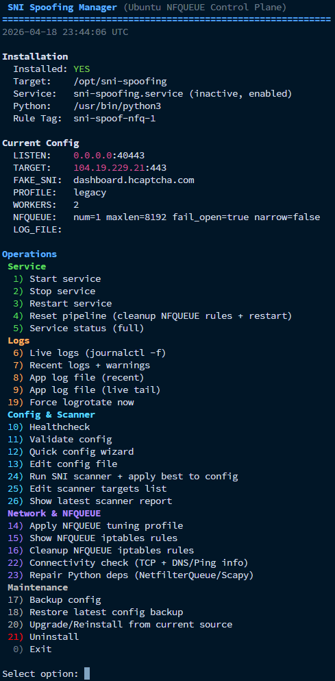
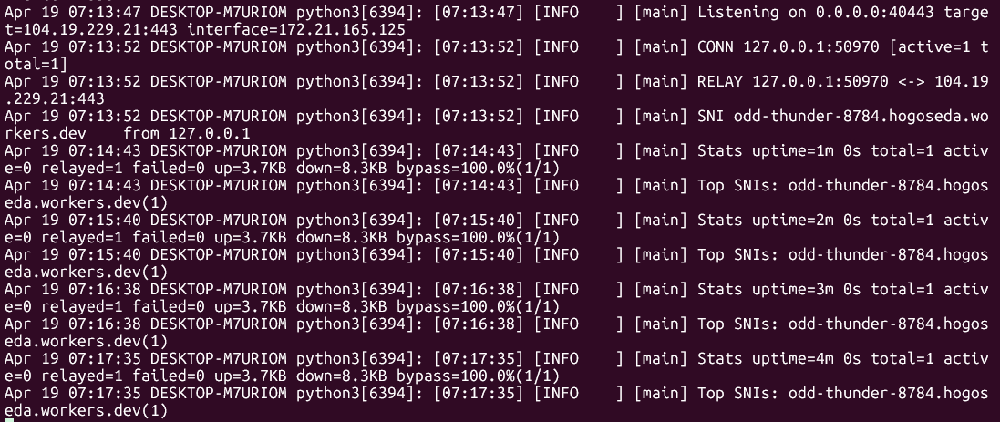

# SNI-Spoofing-Pro
Bypass DPI with IP/TCP header manipulation.

## One-Line Install (Ubuntu Server)
```bash
sudo bash -c 'set -e; cd /root; rm -rf SNI-Spoofing-Pro-main; curl -fsSL https://github.com/B3hnamR/SNI-Spoofing-Pro/archive/refs/heads/main.tar.gz | tar -xz; chmod +x /root/SNI-Spoofing-Pro-main/deploy/sni-manager.sh; /root/SNI-Spoofing-Pro-main/deploy/sni-manager.sh'
```

This command installs/updates and opens the interactive manager.

## Showcase



## Fork Notice
This repository is the main maintained fork in this account, based on:
- Upstream: `patterniha/SNI-Spoofing`
- Upstream URL: https://github.com/patterniha/SNI-Spoofing

## Acknowledgment
Special thanks to **patterniha** for the original project and foundation.

## Donation
Support ongoing development:
- USDT (BEP20): `0x76a768B53Ca77B43086946315f0BDF21156bF424`
- USDT (TRC20): `TU5gKvKqcXPn8itp1DouBCwcqGHMemBm8o`
- Telegram: https://t.me/projectXhttp
- Telegram: https://t.me/patterniha

## Platform Model
- Windows: WinDivert (`pydivert`) path
- Linux (Ubuntu): active interception with `NFQUEUE` + raw packet injection (not passive sniff-only)

## How Linux Mode Works
1. TCP handshake packets are redirected to `NFQUEUE`.
2. Outbound ACK is held in queue.
3. Fake TLS packet (`wrong_seq`) is injected.
4. Held packet is accepted immediately after fake injection.
5. Relay starts only when bypass handshake is confirmed.

## Key Features
- Structured logging (`LOG_LEVEL`, optional `LOG_FILE`)
- SNI extraction and periodic stats (`LOG_CLIENT_SNI`, `STATS_INTERVAL`)
- Rate limit and connection limits (`RATE_LIMIT`, `MAX_CONNECTIONS`)
- Idle timeout and resource backoff (`IDLE_TIMEOUT`, `RESOURCE_PRESSURE_BACKOFF`)
- TLS profile control (`BROWSER_PROFILE`)
- Worker-based fake send (`FAKE_SEND_WORKERS`)
- NFQUEUE hardening (`NFQUEUE_MAXLEN`, `NFQUEUE_FAIL_OPEN`, `NARROW_NFQUEUE_FILTER`)
- Production manager UI with grouped operations
- Integrated scanner with:
  - TCP pre-scan
  - E2E bypass validation
  - auto-rollback if E2E result is bad
  - JSON/TXT reports

## Default Config (First Install)
`config.json` default:

```json
{
  "LISTEN_HOST": "0.0.0.0",
  "LISTEN_PORT": 40443,
  "CONNECT_IP": "104.19.230.21",
  "CONNECT_PORT": 443,
  "FAKE_SNI": "dashboard.hcaptcha.com",
  "NFQUEUE_NUM": 1,
  "NFQUEUE_MAXLEN": 16384,
  "NFQUEUE_FAIL_OPEN": true,
  "NARROW_NFQUEUE_FILTER": false,
  "BYPASS_TIMEOUT": 8.0,
  "CONNECT_TIMEOUT": 5.0,
  "FAKE_DELAY_MS": 0.0,
  "BROWSER_PROFILE": "random",
  "TTL_SPOOF": false,
  "FAKE_SEND_WORKERS": 4,
  "RECV_BUFFER": 65536,
  "MAX_CONNECTIONS": 0,
  "IDLE_TIMEOUT": 120,
  "RATE_LIMIT": 0,
  "HANDLE_LIMIT": 512,
  "ACCEPT_BACKLOG": 512,
  "RESOURCE_PRESSURE_BACKOFF": 0.3,
  "LOG_LEVEL": "INFO",
  "LOG_FILE": "",
  "LOG_CLIENT_SNI": true,
  "STATS_INTERVAL": 60
}
```

## Requirements (Ubuntu)
```bash
sudo apt update
sudo apt install -y \
  git python3 python3-pip python3-dev \
  build-essential libpcap-dev libnetfilter-queue-dev \
  iptables logrotate ca-certificates iputils-ping
```

Python dependencies are platform-aware in `requirements.txt`:
- Windows: `pydivert`
- Linux: `scapy`, `NetfilterQueue`

Run with root privileges on Linux (`sudo`) for `NFQUEUE` + raw packet operations.

## Deployment Modes
### A) Unified Manager (Recommended)
```bash
cd /path/to/SNI-Spoofing-Pro
chmod +x deploy/sni-manager.sh
sudo ./deploy/sni-manager.sh
```

Behavior:
- First run: installs dependencies, deploys to `/opt/sni-spoofing`, installs systemd/logrotate, starts service, opens menu.
- Next runs: open menu directly.

Manager dashboard shows:
- Installation state
- Current config
- `SERVICE_STATE` (`active/inactive`, `enabled/disabled`)

### B) Non-Interactive Installer
```bash
cd /path/to/SNI-Spoofing-Pro
chmod +x deploy/install-production.sh
sudo ./deploy/install-production.sh
```

## Scanner (Option 24)
Integrated scanner files:
- `deploy/sni_target_scanner.py`
- `deploy/scanner_targets.txt`

What it does:
1. Resolve domain targets to IPv4.
2. Probe TCP ports (default: `443,2053,2083,2087,2096,8443`).
3. Rank candidates by preferred port and latency.
4. Run E2E validation on top candidates:
   - temporary config apply
   - service restart
   - local listener probes
   - journal analysis for `RELAY` / bypass failures
5. Apply best candidate or rollback automatically when E2E score is zero.
6. Save reports:
   - `/var/log/sni-spoofing/scanner/sni-scan-*.json`
   - `/var/log/sni-spoofing/scanner/sni-scan-*.txt`

Manager shortcuts:
- `24`: run scanner (`TCP + E2E`) and apply best/rollback
- `25`: edit scanner targets list
- `26`: show latest scanner report (summary view)

Direct run:
```bash
sudo python3 /opt/sni-spoofing/deploy/sni_target_scanner.py \
  --config /opt/sni-spoofing/config.json \
  --targets-file /opt/sni-spoofing/deploy/scanner_targets.txt \
  --output-dir /var/log/sni-spoofing/scanner \
  --e2e-validate \
  --e2e-service-unit sni-spoofing.service \
  --e2e-top-k 3 \
  --e2e-attempts 3 \
  --apply-best
```

## Offline Install (No PyPI Access)
This repo now includes local wheels in:
- `deploy/offline-wheels/`

Installer order:
1. try local wheelhouse (`deploy/offline-wheels`)
2. try normal pip
3. retry with `--break-system-packages` (PEP 668)
4. fallback from optional bundle tar:
   - `sni-spoofing-offline-bundle-*.tar.gz`

So on blocked networks, keep the project complete (including `deploy/offline-wheels`) and run manager/install script.

## Healthcheck
```bash
sudo python3 /opt/sni-spoofing/deploy/healthcheck.py \
  --config /opt/sni-spoofing/config.json \
  --systemd-unit sni-spoofing.service
```

Healthcheck validates:
- config parse
- listen port sanity
- systemd active state
- local TCP listener reachability

## Useful Commands
```bash
sudo systemctl restart sni-spoofing
sudo systemctl status sni-spoofing --no-pager
sudo journalctl -u sni-spoofing -f
```

## Manual NFQUEUE Rules (Template)
Example queue `1`:
```bash
sudo iptables -I OUTPUT 1 -p tcp -s <LOCAL_IP> -d <CONNECT_IP> --dport <CONNECT_PORT> --tcp-flags SYN,ACK,FIN,RST SYN -m comment --comment sni-spoof-nfq-1 -j NFQUEUE --queue-num 1 --queue-bypass
sudo iptables -I OUTPUT 1 -p tcp -s <LOCAL_IP> -d <CONNECT_IP> --dport <CONNECT_PORT> --tcp-flags SYN,ACK,FIN,RST,PSH ACK -m comment --comment sni-spoof-nfq-1 -j NFQUEUE --queue-num 1 --queue-bypass
sudo iptables -I INPUT 1 -p tcp -s <CONNECT_IP> -d <LOCAL_IP> --sport <CONNECT_PORT> --tcp-flags SYN,ACK SYN,ACK -m comment --comment sni-spoof-nfq-1 -j NFQUEUE --queue-num 1 --queue-bypass
sudo iptables -I INPUT 1 -p tcp -s <CONNECT_IP> -d <LOCAL_IP> --sport <CONNECT_PORT> --tcp-flags SYN,ACK,FIN,RST,PSH ACK -m comment --comment sni-spoof-nfq-1 -j NFQUEUE --queue-num 1 --queue-bypass
```

If `NFQUEUE_FAIL_OPEN=false`, remove `--queue-bypass` from rules.
