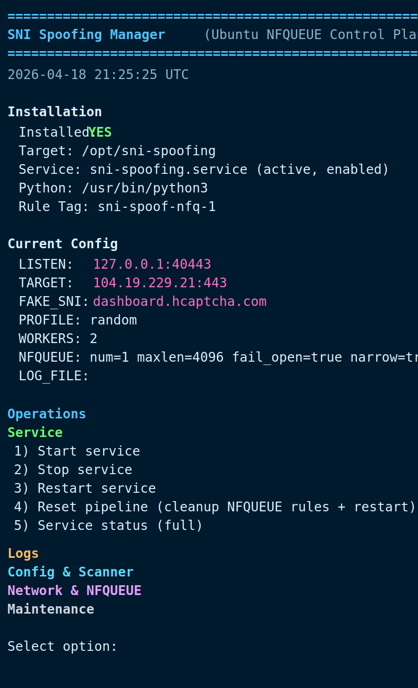

# SNI-Spoofing-Pro
Bypass DPI with IP/TCP header manipulation.

## Fork Notice
This repository is the main maintained fork in this account, based on:

- Upstream: `patterniha/SNI-Spoofing`
- Upstream URL: https://github.com/patterniha/SNI-Spoofing

## Acknowledgment
Special thanks to **patterniha** for the original project and foundation.

## Donation
Support ongoing development:

- USDT (BEP20): `0x76a768B53Ca77B43086946315f0BDF21156bF424`
- USDT (TRC20): `TU5gKvKqcXPn8itp1DouBCwcqGHMemBm8o`
- Telegram: https://t.me/projectXhttp
- Telegram: https://t.me/patterniha

## Showcase


Ubuntu manager UI with grouped operations, scanner integration, and live service/config state.

## Platform Model
- Windows: WinDivert (`pydivert`) injection path
- Linux (Ubuntu): active interception via `NFQUEUE` + `iptables` (not passive sniff-only)

## How Linux Path Works
1. Handshake packets are redirected to `NFQUEUE`.
2. Outbound ACK is held.
3. Fake TLS packet is injected (`wrong_seq`).
4. Held packet is accepted immediately after fake send.
5. Relay starts only when bypass handshake succeeds.

## Runtime Features
- Structured logs (`LOG_LEVEL`, optional `LOG_FILE`)
- Client SNI extraction and periodic stats (`LOG_CLIENT_SNI`, `STATS_INTERVAL`)
- IP-based rate limiting (`RATE_LIMIT`)
- Connection cap (`MAX_CONNECTIONS`)
- Idle timeout (`IDLE_TIMEOUT`)
- Resource pressure backoff (`RESOURCE_PRESSURE_BACKOFF`)
- Browser profile modes (`legacy`, `random`, `chrome`, `firefox`, `safari`, `edge`)
- Fake-send worker pool (`FAKE_SEND_WORKERS`)
- Optional TTL spoofing (`TTL_SPOOF`)
- NFQUEUE hardening (`NFQUEUE_MAXLEN`, `NFQUEUE_FAIL_OPEN`, `NARROW_NFQUEUE_FILTER`)

## Requirements (Ubuntu)
```bash
sudo apt update
sudo apt install -y \
  python3 python3-pip python3-dev \
  build-essential libpcap-dev libnetfilter-queue-dev \
  iptables logrotate ca-certificates iputils-ping
```

Python deps are platform-aware in `requirements.txt`:
- Windows: `pydivert`
- Linux: `scapy`, `NetfilterQueue`

Linux execution requires root (`sudo`) for NFQUEUE/iptables/raw packet operations.

## Default Config (Bundled `config.json`)
```json
{
  "LISTEN_HOST": "127.0.0.1",
  "LISTEN_PORT": 40443,
  "CONNECT_IP": "104.19.229.21",
  "CONNECT_PORT": 443,
  "FAKE_SNI": "dashboard.hcaptcha.com",
  "NFQUEUE_NUM": 1,
  "NFQUEUE_MAXLEN": 4096,
  "NFQUEUE_FAIL_OPEN": true,
  "NARROW_NFQUEUE_FILTER": true,
  "BYPASS_TIMEOUT": 2.0,
  "CONNECT_TIMEOUT": 5.0,
  "FAKE_DELAY_MS": 1.0,
  "BROWSER_PROFILE": "random",
  "TTL_SPOOF": true,
  "FAKE_SEND_WORKERS": 2,
  "RECV_BUFFER": 65536,
  "MAX_CONNECTIONS": 0,
  "IDLE_TIMEOUT": 120,
  "RATE_LIMIT": 0,
  "HANDLE_LIMIT": 256,
  "ACCEPT_BACKLOG": 256,
  "RESOURCE_PRESSURE_BACKOFF": 0.5,
  "LOG_LEVEL": "INFO",
  "LOG_FILE": "",
  "LOG_CLIENT_SNI": true,
  "STATS_INTERVAL": 60
}
```

## Quick Run
Linux:
```bash
sudo python3 main.py
```

Windows:
```bash
python main.py
```

## Production Deployment
Assets in `deploy/`:
- `sni-manager.sh`
- `install-production.sh`
- `sni_target_scanner.py`
- `scanner_targets.txt`
- `healthcheck.py`
- `sni-spoofing.service.template`
- `logrotate-sni-spoofing.conf`

### Option A: Unified Manager (Recommended)
```bash
cd /path/to/SNI-Spoofing-Pro
chmod +x deploy/sni-manager.sh
sudo ./deploy/sni-manager.sh
```

Behavior:
- First run auto-installs dependencies + service + logrotate, then opens menu.
- Next runs open menu directly.
- After config changes, manager runs validation and connectivity checks.

Menu groups:
- Service: start/stop/restart/reset/status
- Logs: journal/app logs/logrotate
- Config & Scanner: healthcheck/validate/wizard/editor/scanner/report tools
- Network & NFQUEUE: tuning/rules/connectivity/dependency repair
- Maintenance: backup/restore/upgrade/uninstall

Connectivity check (`option 22`) policy:
- TCP reachability to `CONNECT_IP:CONNECT_PORT` is the pass/fail criterion.
- DNS and ICMP ping results are informational only.

### Option B: Non-interactive Installer
```bash
cd /path/to/SNI-Spoofing-Pro
chmod +x deploy/install-production.sh
sudo ./deploy/install-production.sh
```

## Integrated Scanner
Built-in scanner inspired by `seramo/sni-scanner`.

Files:
- `deploy/sni_target_scanner.py`
- `deploy/scanner_targets.txt`

What it does:
- Resolves target hostnames to IPv4
- Probes ports (default: `443,2053,2083,2087,2096,8443`)
- Stores reports in:
  - `/var/log/sni-spoofing/scanner/sni-scan-*.json`
  - `/var/log/sni-spoofing/scanner/sni-scan-*.txt`
- Chooses best reachable candidate
- Can update config directly (`CONNECT_IP`, `CONNECT_PORT`, `FAKE_SNI`)

Direct run:
```bash
sudo python3 /opt/sni-spoofing/deploy/sni_target_scanner.py \
  --config /opt/sni-spoofing/config.json \
  --targets-file /opt/sni-spoofing/deploy/scanner_targets.txt \
  --output-dir /var/log/sni-spoofing/scanner \
  --apply-best
```

Manager shortcuts:
- `24`: run scanner + apply best
- `25`: edit targets list
- `26`: show latest report

## Offline Fallback Install (No PyPI Access)
If server cannot access `pypi.org`, place an offline bundle tar in source root:

- `sni-spoofing-offline-bundle-*.tar.gz`

Installer flow:
1. Try normal pip install
2. Retry with `--break-system-packages`
3. Fallback to offline bundle (`--no-index --find-links`)

Supported in both:
- `deploy/install-production.sh`
- `deploy/sni-manager.sh` (bootstrap + repair path)

## Healthcheck
```bash
sudo python3 /opt/sni-spoofing/deploy/healthcheck.py \
  --config /opt/sni-spoofing/config.json \
  --systemd-unit sni-spoofing.service
```

Checks:
- Config readability
- Port sanity
- systemd unit state
- Local TCP listener reachability

## Manual NFQUEUE Rules (Template)
Example queue `1`:
```bash
sudo iptables -I OUTPUT 1 -p tcp -s <LOCAL_IP> -d <CONNECT_IP> --dport <CONNECT_PORT> --tcp-flags SYN,ACK,FIN,RST SYN -m comment --comment sni-spoof-nfq-1 -j NFQUEUE --queue-num 1 --queue-bypass
sudo iptables -I OUTPUT 1 -p tcp -s <LOCAL_IP> -d <CONNECT_IP> --dport <CONNECT_PORT> --tcp-flags SYN,ACK,FIN,RST,PSH ACK -m comment --comment sni-spoof-nfq-1 -j NFQUEUE --queue-num 1 --queue-bypass
sudo iptables -I INPUT 1 -p tcp -s <CONNECT_IP> -d <LOCAL_IP> --sport <CONNECT_PORT> --tcp-flags SYN,ACK SYN,ACK -m comment --comment sni-spoof-nfq-1 -j NFQUEUE --queue-num 1 --queue-bypass
sudo iptables -I INPUT 1 -p tcp -s <CONNECT_IP> -d <LOCAL_IP> --sport <CONNECT_PORT> --tcp-flags SYN,ACK,FIN,RST,PSH ACK -m comment --comment sni-spoof-nfq-1 -j NFQUEUE --queue-num 1 --queue-bypass
```

If `NFQUEUE_FAIL_OPEN=false`, remove `--queue-bypass` from manual rules.

## Useful Commands
```bash
sudo systemctl restart sni-spoofing
sudo systemctl status sni-spoofing --no-pager
sudo journalctl -u sni-spoofing -f
```
